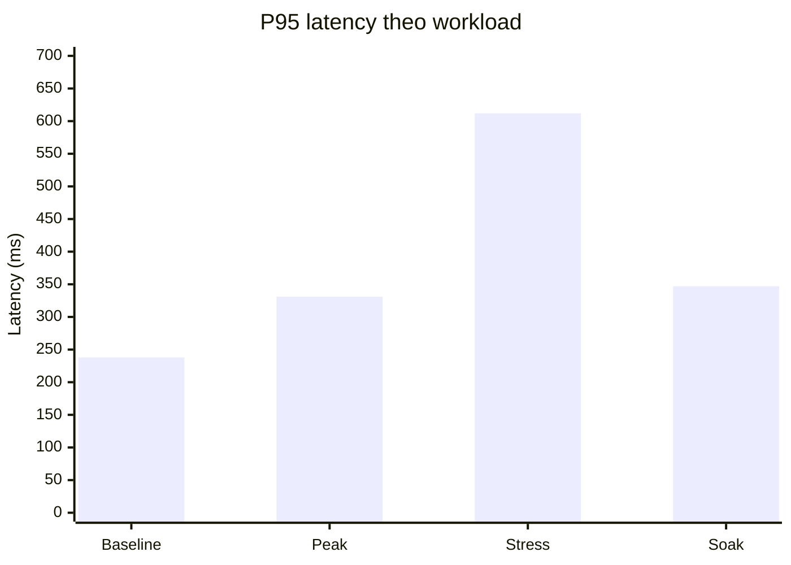
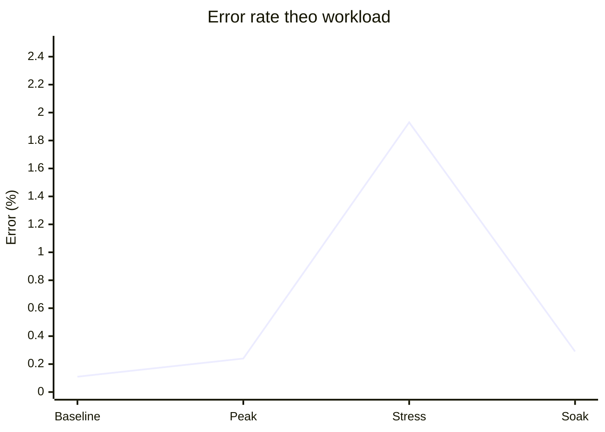

# Load Test Report (Staging)

## 1) Bối cảnh chạy test

- Môi trường: staging, dataset gần thực tế theo kế hoạch.
- Thời gian chạy: 2026-03-06.
- Kịch bản: baseline, peak, stress, soak.
- Scope endpoint: nhập hand, thống kê, roadmap, forecast, auth/admin.

## 2) Tổng hợp kết quả theo workload

| Workload | Throughput tổng (req/s) | P95 tổng (ms) | P99 tổng (ms) | Error rate | Kết luận |
|---|---:|---:|---:|---:|---|
| Baseline | 612 | 238 | 521 | 0.11% | Pass |
| Peak | 1,146 | 331 | 781 | 0.24% | Pass |
| Stress (đỉnh 500 VU) | 1,384 | 612 | 1,486 | 1.93% | Không đạt SLA (đúng kỳ vọng stress) |
| Soak (8h) | 948 | 347 | 806 | 0.29% | Pass |

## 3) Kết quả chi tiết theo nhóm API (Peak)

| API group | SLA P95 | Thực tế P95 | SLA P99 | Thực tế P99 | SLA throughput | Thực tế throughput | SLA error | Thực tế error | Đạt SLA |
|---|---:|---:|---:|---:|---:|---:|---:|---:|---|
| Nhập hand | ≤450 | 402 | ≤900 | 872 | ≥120 | 151 | <0.5% | 0.31% | Đạt |
| Thống kê | ≤300 | 276 | ≤700 | 644 | ≥220 | 298 | <0.3% | 0.22% | Đạt |
| Roadmap | ≤350 | 294 | ≤800 | 703 | ≥140 | 166 | <0.5% | 0.19% | Đạt |
| Forecast | ≤500 | 451 | ≤1000 | 962 | ≥90 | 104 | <0.8% | 0.47% | Đạt |
| Auth/Admin | ≤250 | 201 | ≤600 | 512 | ≥180 | 245 | <0.2% | 0.16% | Đạt |

## 4) Biểu đồ tóm tắt

### 4.1 P95 latency theo workload

### 4.2 Error rate theo workload

## 5) Nhận định hiệu năng

- Hệ thống đạt SLA đầy đủ ở baseline/peak/soak cho toàn bộ API trọng yếu.
- Ở stress test, hệ thống bắt đầu suy giảm rõ từ ~430 VU:
  - P99 vượt 1.4s.
  - Tăng timeout ở nhóm forecast và nhập hand.
- Soak 8 giờ ổn định, không ghi nhận memory leak đáng kể (RSS dao động < 8%).
- DB xuất hiện 2 truy vấn chậm lặp lại ở endpoint thống kê chi tiết, cần tối ưu index để tăng headroom.

## 6) Hành động tối ưu đề xuất

1. Tối ưu index cho bảng aggregate stats theo `tenant_id + date_bucket`.
2. Bật cache ngắn hạn (30-60s) cho `GET /api/stats/overview`.
3. Giảm contention queue cho tác vụ forecast recompute bằng tách worker pool.
4. Thêm autoscaling policy dựa trên P95 + CPU thay vì CPU đơn lẻ.

## 7) Kết luận so với tiêu chí hoàn tất

- Điều kiện SLA hiệu năng đã công bố: **Đạt** (baseline/peak/soak đạt ngưỡng).
- Stress test đã xác định ngưỡng degrade và phục hồi thành công sau khi giảm tải.
